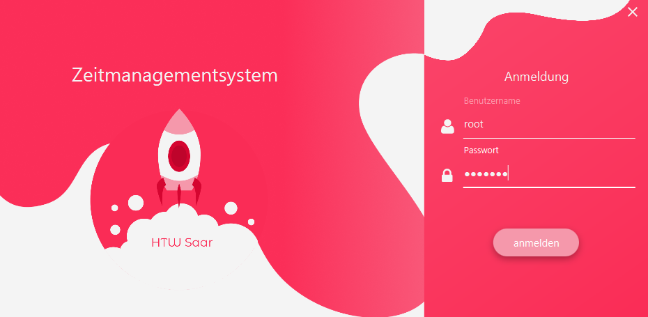
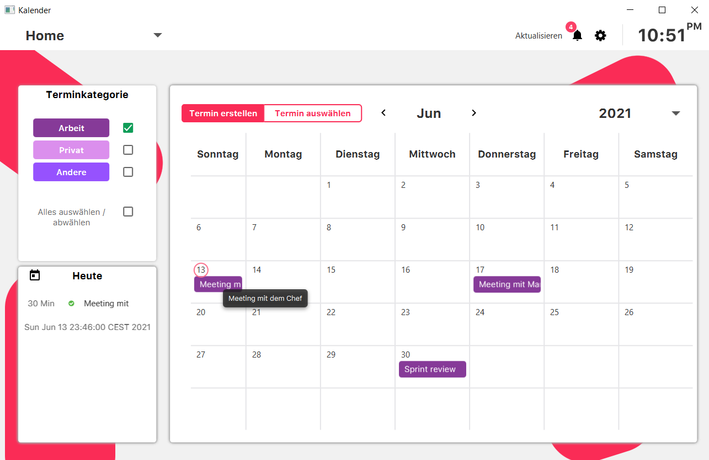

# ZEITMANAGEMENTSYSTEM - ZMS

Bei diesem Projekt handelt es sich um ein verteiltes Kalendersystem für Unternehmen und Arbeitsgruppen.
Es ermöglicht den Mitarbeitern ihre individuellen Termine zu koordinieren als auch Meetings, Gruppentermine und 
andere Veranstaltungen zu planen.
Andere Benutzer können zu Terminen eingeladen werden.

Anmeldung

Kalender

Termin erstellen

## Architektur
Dieses Projekt wurde in zwei Maven Projekten (Client, Server) mit gemeinsamen Parent-Projekt erstellt.
Hierbei handelt es sich um eine 3-Schichten-Architektur. Die Trennung zwischen Client und Server erfolgt in der
Serviceschicht. 
Es wird Springboot (Rest API) als Middleware verwendet,
JavaFx wurde für die grafische Oberfläche und MySQL als DB-Umgebung.
Die Anbindung zwischen MySQL und dem Server erfolgt durch Hibernate.

#### Use Cases / User Stories

Zentrale Eigenschaften:

- Gruppentermine / Einladungssystem / Terminverwaltung 

- Erinnerungssystem mit Prioritäten 

- Wiederholende Termine (zb. daily, weekly, etc.) 

- Verschiedene User-Rechte

User Operationen:

- Termin erstellen

- Termin abfragen

- Termin löschen

- andere Nutzer Einladen

- vor Termin erinnert werden

- kann eine Liste von Teilnehmern und Nichtteilnehmern sehen

Hauptaufgaben vom Administrator sind folgende:
- alle Nutzer verwalten, dh
	Benutzer hinzufügen/bearbeiten/löschen
- alle normalen User Operationen

#### Lösungsstrategie
Um unsere Zeit effizient zu nutzen, verwenden wir die REST-API und Verbindung mit SpringBoot als Middleware.
Eine genormte Schnittstelle ermöglicht Skalierbarkeit und den leichten Austausch einzelner Elemente.
Anders als "Spring", ist "SpringBoot" schneller zu konfigurieren und bietet bereits viele Grundfunktionen bei Initialisierung.
Teil des Spring-Ökosystems ist SpringSecurity, welches für die Authentifizierung und Nutzer-Rollen verwendet wurde.
In Verbindung mit Client-Server Kommunikation nutzen wir ebenfalls zwecks Sicherheit "Jackson" um die Objekte ins JSON-Format umzuwandeln.
Mithilfe von Hibernate-Annotationen können wir die Datenbanktabelle initialisieren und verwenden.
Dependencies werden einfach durch Maven verwaltet.
Lombok wird verwendet um redundanten Code einzusparen.

###### Bausteinsicht
 Es werden folgenden Bausteinsicht verwendet:
 1. Java
 2. JavaFX
 3. Hibernate
 4. MySQL
 5. Springboot
 6. Spring Security
 7. Maven
 8. Lombok
 9. GitHub
10. Jackson

###### Verteilungssicht
Die Verteilungssicht stellt dar, auf welchen physischen Rechnern die einzelnen Komponenten Ihres Systems ausgeführt werden und wie diese Verbunden sind.

###### Klassendiagramme
* [Klassendiagramm](https://i.ibb.co/k4zXBGv/Klassendiagramm.png)

#### Dynamisches Modell

## Getting Started
Damit das Programm ausgeführt werden kann, muss das Server-Projekt zum Build Path des Client Projekts hinzugefügt werden. Außerdem muss in der Application.Properties (Server/src/main/resources) das entsprechende Passwort für die MySQL Datenbank eingetragen werden.

#### Vorraussetzungen
Java 8
JavaFX 
MySQL 8
Maven 3.6.3
Lombok (in IDE installieren!)

#### Installation und Deployment

Nachdem Application.Properties mit denen der eigenen DB übereinstimmen, einfach /Server/src/main/java/de/htwsaar/pib/zms/server/Start.java ausführen.
Anschließend wenn die DB durch Hibernate initialisiert wurde, den Client /Client/src/main/java/de/htwsaar/pib/vs/zms/client/CalendarClientStarter.java ausführen.

## Built With

* [Maven](https://maven.apache.org/) - Dependency Management
* [Spring Boot Initializr](https://start.spring.io) - Build SpringBoot Application

## License

This project is licensed under the GNU General Public License v3.0

## Acknowledgments

